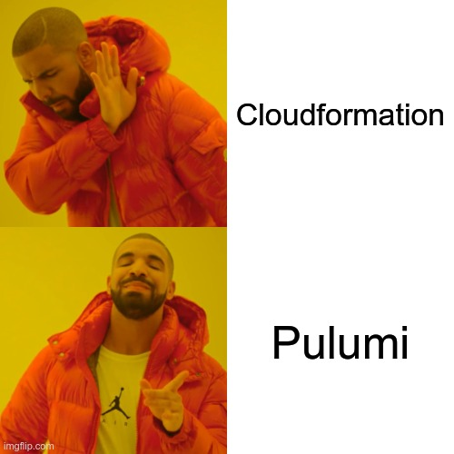

# Week 18 labs

AWS Cloud security



- introducing Pulumi (as an alternative to Cloudformation)
- AWS Security Hub
- AWS Prowler

## Todo

- [ ] ClickOps AWS Security Hub on your account
- [ ] Install AWS Prowler
- [ ] Install Pulumi
- [ ] Deploy application
- [ ] Run Prowler on ec2
- [ ] Fix script to reduce number of prowler alerts
- [ ] Redploy and run prowler

Lowest number of prowler issues wins

## Getting started

We're going to deploy an insecure application to AWS

### Install Pulumi

```bash
# install pulumi and then start a new terminal
# see https://www.pulumi.com/docs/get-started/aws/begin/
curl -fsSL https://get.pulumi.com | sh
```

### Deploy the insecure stack

```bash
# ensure AWS creds are exported to current env

# also export this bucket name
# shove in the aws account id to make it globally unique
export PULUMI_STATE_BUCKET_NAME="jujhar-$(aws sts get-caller-identity --query Account --output text)-pulumi-state-store"

# create Pulumi s3 state store bucket to store the state in
aws s3api create-bucket \
  --bucket "${PULUMI_STATE_BUCKET_NAME}" \
  --region eu-west-1 \
  --create-bucket-configuration LocationConstraint=eu-west-1

# tell Pulumi you're using this bucket as your state store
pulumi login s3://"${PULUMI_STATE_BUCKET_NAME}"

# install node deps
(cd infra && npm i)

# Check stack
(cd infra && pulumi preview)

# Deploy stack
(cd infra && pulumi up)

# destroy stack
(cd infra && pulumi down)
```
